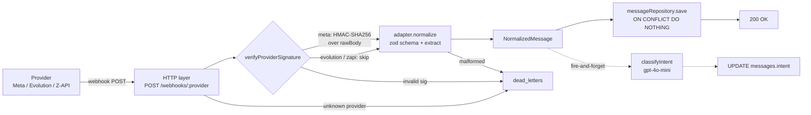

# WhatsApp Webhook Normalizer

Camada de ingestão unificada que normaliza webhooks de múltiplos provedores de WhatsApp (Meta Cloud API, Evolution API, Z-API) em um formato interno único. TypeScript + Node + Express + Postgres (Supabase).

Construído como prova técnica para uma plataforma de automação/CRM SDR.

---

## Sumário

- [Arquitetura (diagrama)](#arquitetura)
- [Como rodar](#como-rodar)
- [Stack](#stack)
- [Decisões técnicas](#decisões-técnicas)
- [Como adicionar um novo provedor](#como-adicionar-um-novo-provedor)
- [Segurança](#segurança)
- [Como testar (cURL + Postman)](#como-testar)
- [Integração com o CRM (contexto de produto)](#integração-com-o-crm)
- [Escalabilidade do pattern](#escalabilidade-do-pattern)
- [Deploy alternativo — Supabase Edge Functions](#deploy-alternativo)
- [Desafios encontrados](#desafios-encontrados)
- [Checklist de funcionalidades](#checklist-de-funcionalidades)
- [Suposições](#suposições)
- [Uso de IA no desenvolvimento](#uso-de-ia-no-desenvolvimento)

---

## Arquitetura



**Camadas:**

- **HTTP layer** ([src/http/server.ts](src/http/server.ts)) — Express com `rawBody` preservado; rota única parametrizada `POST /webhooks/:provider`; error handler global que mapeia erros tipados → status HTTP + dead_letters.
- **Security** ([src/security/](src/security/)) — dispatcher por provedor; HMAC-SHA256 implementado para Meta; stub pronto para plugar outros.
- **Adapter registry** ([src/core/registry.ts](src/core/registry.ts)) — `Map<providerId, ProviderAdapter>` com lookup O(1); `register()` / `get()` / `list()`.
- **Provider adapters** ([src/adapters/](src/adapters/)) — um arquivo `*.adapter.ts` por provedor; cada um autossuficiente (schema zod + `normalize`). **Auto-discovery**: [src/adapters/index.ts](src/adapters/index.ts) escaneia a pasta no boot e registra automaticamente.
- **Normalized model** ([src/core/types.ts](src/core/types.ts)) — tipo único `NormalizedMessage`.
- **Persistence** ([src/db/repositories.ts](src/db/repositories.ts)) — `pg` puro + SQL migrations; idempotência via `UNIQUE (provider_id, external_id)`.
- **Observability** ([src/observability/logger.ts](src/observability/logger.ts)) — logger JSON estruturado (zero deps) com `requestId`, `providerId`, `externalMessageId`, `durationMs`, `status`.
- **LLM** ([src/llm/classifier.ts](src/llm/classifier.ts)) — classificação de intenção pós-persistência, fire-and-forget.

---

## Como rodar

### Pré-requisitos

- Node.js ≥ 18 (usamos 22 em dev)
- Conta Supabase (grátis) OU qualquer Postgres com `DATABASE_URL`
- (Opcional) API key da OpenAI para classificação de intenção

### 1. Clone e instale

```bash
git clone <repo-url>
cd whatsapp-webhook-normalizer
npm install
```

### 2. Crie o banco no Supabase

1. Acesse [supabase.com/dashboard](https://supabase.com/dashboard) → **New project** (grátis)
2. Aguarde o provisionamento (~2 min)
3. Vá em **Project Settings → Database → Connection string → URI**
4. Copie a string e substitua `[YOUR-PASSWORD]` pela senha do projeto

### 3. Configure `.env`

```bash
cp .env.example .env
```

Edite `.env`:
```
PORT=3000
DATABASE_URL=postgresql://postgres:<password>@db.<project-ref>.supabase.co:5432/postgres
META_APP_SECRET=          # opcional (skip HMAC se vazio)
META_VERIFY_TOKEN=        # opcional (necessário só pra handshake da Meta)
OPENAI_API_KEY=           # opcional (classificação de intenção desativa se vazio)
```

### 4. Aplique as migrations

```bash
npm run migrate
```

Saída esperada:
```
[applied] 001_init.sql
[applied] 002_dead_letters_drop_fk.sql
[applied] 004_drop_providers_table.sql

Done. 3 migration(s) applied.
```

### 5. Suba o servidor

```bash
npm run dev
```

Log de startup:
```json
{"time":"...","level":"info","message":"server started","port":3000,"adapters":["meta","evolution","zapi","fake"],"llm":"disabled (OPENAI_API_KEY not set)"}
```

Pronto. O servidor escuta em `http://localhost:3000`.

---

## Stack

| Camada | Escolha | Motivo |
|---|---|---|
| Linguagem | TypeScript (strict) | Tipagem forte; alinhamento com o stack da empresa |
| Runtime | Node.js | Express + `rawBody` trivial; ecossistema maduro |
| Banco | **Supabase Postgres** (managed) | Zero infra local, alinhamento com o stack em produção |
| Cliente DB | `pg` puro + SQL migrations | Schema visível, sem ORM |
| HTTP | Express 5 | `rawBody` 2 linhas; middleware async nativo |
| Validação | zod 4 | Tipagem inferida direto do schema |
| LLM | OpenAI `gpt-4o-mini` | Latência baixa, custo mínimo, suporta JSON mode |

Decisões completas em [docs/decisions.md](docs/decisions.md).

---

## Decisões técnicas

Resumo dos ADRs; completos em [docs/decisions.md](docs/decisions.md).

### Pattern: Strategy + Registry

Cada provedor é uma **Strategy** (arquivo isolado que implementa `ProviderAdapter`). O **Registry** faz lookup por `providerId` em O(1). A URL `/webhooks/:provider` carrega o ID — metadata gratuita do transporte.

**Rejeitados:**
- **Chain of Responsibility** com `canHandle(payload)` — introduz ordem e ambiguidade; desnecessário quando a URL já identifica o provedor.
- **Config-driven mapping em DB** (estilo Zapier) — os provedores têm lógica condicional (`conversation ?? extendedTextMessage` no Evolution), auth específica (HMAC da Meta) e conversões de timestamp heterogêneas que não cabem em JSONPath.

### Framework HTTP: Express

`express.json({ verify })` preserva `rawBody` em 2 linhas — requisito do HMAC-SHA256 da Meta (qualquer re-serialização do JSON mudaria os bytes e quebraria a assinatura).

### Validação: zod

Schema é a fonte da verdade; `z.infer` elimina duplicação. Erros vêm com path do campo problemático — vai para `dead_letters`.

### Banco: Supabase Postgres, `pg` puro

Managed (zero infra) e alinhado com o stack Supabase-native da empresa. `pg` cru + SQL visível em `db/migrations/*.sql` — nada de mágica de ORM.

---

## Como adicionar um novo provedor

Guia completo em [docs/adding-a-provider.md](docs/adding-a-provider.md). Resumo:

**1 arquivo novo, zero alterados** — o `src/adapters/index.ts` faz auto-discovery de qualquer `*.adapter.ts` na pasta:

1. Criar [src/adapters/<nome>.adapter.ts](src/adapters/) — implementa `ProviderAdapter` (~20 linhas; ver [src/adapters/fake.adapter.ts](src/adapters/fake.adapter.ts) como referência)
2. Reiniciar o servidor

**Zero arquivos existentes tocados, zero migration.** A rota `/webhooks/<nome>` já existe (é parametrizada), o registry pega o adapter em O(1), e o boot descobre o novo arquivo automaticamente. `messages.provider_id` é `TEXT` sem FK — o registry valida a existência do adapter em runtime (rota com adapter não cadastrado → 404 `UnknownProviderError` + entrada em `dead_letters`).

---

## Segurança

### Meta — HMAC-SHA256 + verify-token

- **`GET /webhooks/meta`** — handshake inicial da Meta. Valida `hub.verify_token === META_VERIFY_TOKEN`, devolve `hub.challenge` como texto puro (200). Caso contrário 403.
- **`POST /webhooks/meta`** — middleware [`verifyMetaSignature`](src/security/meta.ts) calcula HMAC-SHA256 do `rawBody` com `META_APP_SECRET` e compara com header `X-Hub-Signature-256`. Usa `timingSafeEqual` (proteção contra timing attacks). Falha → 401 + registro em `dead_letters`.
- **Modo dev:** se `META_APP_SECRET` está vazio, middleware faz skip (webhook aceita sem assinatura). Em produção, obrigatório setar a var.

### Evolution e Z-API

Ambos usam autenticação simples por **token em header** (documentada nas respectivas APIs). O dispatcher [`verifyProviderSignature`](src/security/index.ts) tem um `switch` que hoje só trata Meta — adicionar verificação para Evolution/Z-API é um `case` novo (e função de verificação análoga).

Para esta versão, o enunciado exige ≥2 adapters; os outros ficam com hook pronto para plugar.

---

## Como testar

### cURL

**Meta (com HMAC de teste):**
```bash
PAYLOAD='{"entry":[{"changes":[{"value":{"metadata":{"display_phone_number":"5511999999999","phone_number_id":"PID"},"contacts":[{"profile":{"name":"João"},"wa_id":"5511988888888"}],"messages":[{"from":"5511988888888","id":"wamid.test","timestamp":"1677234567","type":"text","text":{"body":"olá"}}]}}]}]}'

# Com META_APP_SECRET=test_secret no .env:
SIG=$(printf '%s' "$PAYLOAD" | openssl dgst -sha256 -hmac "test_secret" -hex | awk '{print $NF}')

curl -X POST http://localhost:3000/webhooks/meta \
  -H "Content-Type: application/json" \
  -H "X-Hub-Signature-256: sha256=$SIG" \
  -d "$PAYLOAD"
# → {"ok":true,"externalMessageId":"wamid.test"}
```

**Evolution:**
```bash
curl -X POST http://localhost:3000/webhooks/evolution \
  -H "Content-Type: application/json" \
  -d '{"event":"messages.upsert","data":{"key":{"remoteJid":"5511988888888@s.whatsapp.net","fromMe":false,"id":"evo-1"},"pushName":"João","message":{"conversation":"olá"},"messageTimestamp":1677234567},"destination":"5511999999999@s.whatsapp.net"}'
```

**Z-API:**
```bash
curl -X POST http://localhost:3000/webhooks/zapi \
  -H "Content-Type: application/json" \
  -d '{"messageId":"zap-1","phone":"5511988888888","senderName":"João","momment":1677234567000,"text":{"message":"olá"}}'
```

**Verify-token da Meta:**
```bash
curl "http://localhost:3000/webhooks/meta?hub.mode=subscribe&hub.verify_token=<SEU_TOKEN>&hub.challenge=CHALLENGE123"
# → CHALLENGE123
```

**Provedor desconhecido → 404:**
```bash
curl -X POST http://localhost:3000/webhooks/telegram -d '{}' -H "Content-Type: application/json"
# → {"ok":false,"error":"UnknownProviderError",...}
```

### Postman

Coleção pronta em [docs/postman_collection.json](docs/postman_collection.json) — importe no Postman/Insomnia, setup variáveis `baseUrl`, `metaAppSecret` e `metaVerifyToken`, rode.

---

## Integração com o CRM

Este serviço é a **camada de ingestão** de um sistema maior de CRM SDR. Em produção, o `NormalizedMessage` persistido aqui é consumido downstream para:

1. **Deduplicação de lead** por `from.phone`
2. **Anexação à timeline** do lead no CRM
3. **Disparo de geração IA de resposta** quando uma campanha estiver configurada como gatilho da etapa do funil em que o lead entrar

### Multi-tenancy (não implementado nesta versão)

Na versão atual, `messages` não tem `workspace_id`. Em produção, a tabela ganharia FK para `workspaces`, derivada do mapeamento `provider_instance → workspace` — cada número WhatsApp conectado pertence a um workspace (ex: o `phone_number_id` da Meta, o `instance` da Evolution, o `instanceId` da Z-API).

Não foi implementado porque o enunciado foca no problema de **normalização de múltiplos formatos**, e adicionar workspaces antes do tempo ofuscaria o pattern central. Mas a adição é aditiva (nova coluna + lookup) e não altera a estrutura do adapter.

---

## Escalabilidade do pattern

O **Strategy + Registry em código** escala bem até dezenas/centenas de provedores mantendo cada um como arquivo isolado — é como Stripe (~200 conectores de pagamento), Segment (400+ destinos) e Airbyte tratam seus catálogos. Evolution/Meta/Z-API são três de ~10 provedores WhatsApp no mercado BR; a contagem total é finita.

### Quando eu migraria para config-driven (JSON/DB mapping)

1. Quando **usuário não-dev** precisar cadastrar provedor (caso SaaS tipo Zapier)
2. Quando a maioria dos provedores for **estruturalmente trivial** (só renomear paths, sem HMAC/auth customizado)
3. Quando a frequência de novos provedores ultrapassar ~1/semana

### Por que não fiz agora

Os 3 provedores do escopo têm:
- **Auth específica** (HMAC-SHA256 com `rawBody` na Meta, tokens em header nos outros)
- **Conversões não-triviais** (timestamp unix segundos vs milissegundos vs ISO; JID com sufixo `@s.whatsapp.net` no Evolution)
- **Lógica condicional** (`message.conversation ?? message.extendedTextMessage.text` no Evolution)

Um engine genérico precisaria de "escape hatches" para cada um — resultado: 2 caminhos de código pra manter sem economia real. Manter adapter-por-arquivo e evoluir para híbrido quando o 10º provedor chegar é a trajetória correta.

---

## Deploy alternativo

O enunciado sugere **Supabase Edge Functions**. Optei por **Node local** como alvo primário porque:

- Express 5 + `rawBody` para HMAC é trivial
- `pg` puro + SQL migrations ficam totalmente visíveis
- O avaliador consegue rodar com `npm run dev` em 5 min

### Se fosse migrar para Edge Functions

1. Trocar Express por **Hono** (melhor suporte a Deno/Edge; API similar)
2. Trocar `pg` por **`postgres`** do Deno (ou usar `@supabase/supabase-js`)
3. Adaptar `rawBody` — em Edge Functions, `await request.text()` retorna o corpo bruto
4. Migrations continuam via Supabase CLI (`supabase db push`)

O core (adapters, registry, normalized model, repositories) é portável sem alteração.

---

## Desafios encontrados

Problemas reais que enfrentei e como resolvi:

### 1. Express 5: `req.params` vazio no error middleware global

**Problema:** no handler de erro global (`app.use((err, req, res, next) => ...)`), `req.params.provider` aparecia `undefined` mesmo quando a rota `/webhooks/:provider` havia matcheado. Resultado: `dead_letters.provider_id` ficava `null` em vez de preservar o provedor que falhou.

**Diagnóstico:** Express 5 mudou o lifecycle de `req.params` em middleware global pós-rota. O valor não é garantido.

**Solução:** extrair o provider diretamente do `req.url` via regex simples (`/^\/webhooks\/([^/?]+)/`). Robusto, não depende de Express preservar state.

### 2. FK em `dead_letters` rejeitando provedores desconhecidos

**Problema:** a tabela `dead_letters` tinha FK `provider_id → providers(id)`. Quando um webhook chegava em `/webhooks/telegram` (provedor não cadastrado), o dead_letter INSERT falhava por violação de FK — o caso mais interessante (alguém batendo em rota nova) era justamente o que não era auditado.

**Solução:** migration 002 dropa a FK. `dead_letters` é tabela de **auditoria**, não precisa de integridade referencial; precisa aceitar qualquer `provider_id` string (ou null).

### 3. Timestamps heterogêneos entre provedores

Meta manda segundos **como string** (`"1677234567"`), Evolution manda segundos **como número** (`1677234567`), Z-API manda **milissegundos** (`1677234567000`). Resolvi com conversão localizada em cada adapter — parte da razão pela qual config-driven puro não funcionaria bem aqui.

### 4. `rawBody` + HMAC

Se `express.json()` desserializa o payload antes da verificação HMAC, o hash nunca bate (a string re-serializada muda ordem de chaves, whitespace, etc.). Solução é usar `express.json({ verify: (req, _res, buf) => { req.rawBody = buf } })` e computar o HMAC sobre `req.rawBody`, não sobre `JSON.stringify(req.body)`.

---

## Checklist de funcionalidades

### Obrigatórios
- [x] Sistema recebe webhooks de múltiplos provedores (3 implementados)
- [x] Normalização para formato único (`NormalizedMessage`)
- [x] Extensibilidade demonstrada (adapter `fake` como prova + guia em `docs/`)
- [x] Tratamento de erros tipados (malformed, unknown, signature, processing)
- [x] Schema de DB proposto e aplicado via migrations
- [x] Idempotência via `UNIQUE (provider_id, external_id) + ON CONFLICT`
- [x] LLM descrita **e** implementada (classificação de intenção)
- [x] Código funcional (roda com `npm run dev`)

### Diferenciais
- [x] Diagrama de fluxo (Mermaid)
- [x] Implementação completa de LLM
- [x] Verificação HMAC-SHA256 + verify-token da Meta
- [x] Logger estruturado JSON
- [x] Dead letters para auditoria de falhas
- [ ] Testes unitários formais (pendente — validado via cURL/smoke)
- [ ] Teste com provedor real (fora do escopo atual)

---

## Suposições

- **Apenas mensagens de texto** são normalizadas nesta versão. Mídia (imagem/áudio/documento) fica como extensão futura (o adapter teria que tratar `text` = transcrição ou `text` = caption; ou adicionar campo `media` no `NormalizedMessage`).
- Campo `to` é **opcional**: Z-API não expõe destinatário explicitamente no payload. Para Meta e Evolution, é preenchido com nosso número.
- **HMAC da Meta implementado**; Evolution e Z-API ficam com hook pronto no dispatcher (case-specific futuro).
- **Multi-tenancy não implementado** (ver [Integração com o CRM](#integração-com-o-crm)).
- **Fire-and-forget LLM:** se o processo Node crashar entre `res.send` e a resposta do LLM, a mensagem fica sem `intent`. Pode ser reclassificada depois — é um trade-off aceitável contra a simplicidade de **não** introduzir fila/worker.
- **Deploy alvo é Node local.** Supabase Edge Functions documentado como alternativa (ver [Deploy alternativo](#deploy-alternativo)).

---

## Uso de IA no desenvolvimento

Usei **Claude (Anthropic)** como par de programação ao longo do projeto:

- **Arquitetura:** discussão dos tradeoffs entre Strategy+Registry vs Chain of Responsibility vs config-driven (registrado em [docs/decisions.md](docs/decisions.md) ADR-001).
- **Revisão de schemas zod** para cada provedor, cobrindo edge cases dos payloads oficiais.
- **Rubber duck** em bugs reais: o `req.params` vazio no error middleware do Express 5 e a FK constraint de `dead_letters`.
- **Esboço de documentação:** primeiras versões dos ADRs e do próprio guia de extensibilidade.
- **Discussão de UX do código:** por exemplo, a decisão de fazer a classificação LLM ser silenciosa quando `OPENAI_API_KEY` está ausente (em vez de falhar).

Todas as decisões foram minhas. O código foi revisado e testado linha a linha antes de commitar. A IA foi produtividade e sparring, não autoria.
