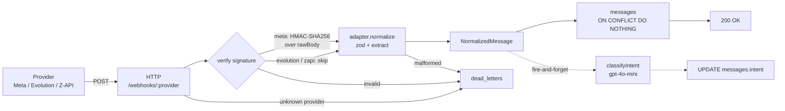

# WhatsApp Webhook Normalizer

Camada de ingestão unificada que recebe webhooks de múltiplos provedores de WhatsApp (Meta Cloud API, Evolution API, Z-API) e os normaliza em um formato interno único. TypeScript + Node + Express + Postgres.

---

## Endpoints

| Provedor | Rota | Método |
|---|---|---|
| Meta Cloud API | `POST /webhooks/meta` · `GET /webhooks/meta` (handshake) | POST / GET |
| **Evolution API** | **`POST /webhooks/evolution`** | POST |
| Z-API | `POST /webhooks/zapi` | POST |

---

## Checklist

**Obrigatórios (seção 3)**
- [x] Webhooks de múltiplos provedores (3 implementados)
- [x] Normalização para `NormalizedMessage`
- [x] Extensibilidade via auto-discovery de adapters
- [x] Tratamento de erros: malformed (400), unknown provider (404), assinatura inválida (401), falha no processamento (500 fallback) — todos com persistência em `dead_letters`
- [x] Schema de DB via migrations SQL
- [x] Idempotência (`UNIQUE + ON CONFLICT`)
- [x] LLM implementada (classificação de intenção)

**Diferenciais (seção 6)**
- [x] Diagrama de fluxo (Mermaid)
- [x] Testes unitários (vitest)
- [x] Implementação completa de LLM
- [x] Teste com provedor real (Evolution API em Docker)

**Extras não pedidos**
- HMAC-SHA256 + verify-token da Meta

---

## Arquitetura



**Camadas** ([src/](src/)):

- **HTTP** — Express com `rawBody` preservado; rota parametrizada; error handler tipado → status + `dead_letters`.
- **Security** — dispatcher por provedor; HMAC-SHA256 + verify-token para Meta; hook pronto para os outros.
- **Registry** — `Map<providerId, Adapter>` em O(1).
- **Adapters** — um arquivo `*.adapter.ts` por provedor; [src/adapters/index.ts](src/adapters/index.ts) faz **auto-discovery** no boot (adicionar provedor = só criar o arquivo).
- **Persistence** — `pg` + SQL migrations; idempotência via `UNIQUE (provider_id, external_id)`.
- **LLM** — classificação de intenção pós-persistência, fire-and-forget.
- **Observability** — logger JSON estruturado com `requestId`, `providerId`, `durationMs`.

---

## Como rodar

Pré-requisitos: Node ≥ 18, um Postgres (Supabase grátis funciona), opcionalmente uma `OPENAI_API_KEY`.

```bash
npm install
cp .env.example .env        # editar DATABASE_URL e opcionais
npm run migrate
npm run dev                 # http://localhost:3000
```

`.env` mínimo:
```
DATABASE_URL=postgresql://...
META_APP_SECRET=            # opcional — skip HMAC se vazio
META_VERIFY_TOKEN=          # opcional — só pro handshake da Meta
OPENAI_API_KEY=             # opcional — LLM desativa se vazio
```

---

## Conectando um provedor

A rota a cadastrar no painel do provedor é `POST /webhooks/<adapter.id>` — ex: `/webhooks/meta`, `/webhooks/evolution`, `/webhooks/zapi`. Para testar em dev, `ngrok http 3000` gera o HTTPS público.

---

## Stack

| Camada | Escolha | Motivo |
|---|---|---|
| Linguagem | TypeScript (strict) | Tipagem forte |
| Runtime | Node.js + Express 5 | `rawBody` trivial para HMAC |
| Banco | Supabase Postgres (managed) | Zero infra, alinhado com stack em produção |
| DB client | `pg` puro + SQL migrations | Schema visível, sem ORM |
| Validação | zod | Tipagem inferida direto do schema |
| LLM | OpenAI `gpt-4o-mini` | Baixa latência, JSON mode nativo |

---

## Decisões técnicas

### Pattern: Strategy + Registry

Cada provedor é uma Strategy isolada (um arquivo). O Registry faz lookup por ID em O(1). O ID já vem na URL `/webhooks/:provider`, então não precisa de `canHandle(payload)` com chain de responsabilidade.

**Por que não config-driven (JSON/DB mapping):** os três provedores têm auth específica (HMAC-SHA256 com `rawBody` na Meta), conversões de timestamp heterogêneas (string-segundos vs número-segundos vs milissegundos) e lógica condicional (`conversation ?? extendedTextMessage.text` no Evolution). Um engine genérico precisaria de gambiarras para cada caso — duas coisas pra manter sem ganhar nada. Migro para híbrido quando o 10º provedor chegar.

### Express + `rawBody`

`express.json({ verify })` preserva o corpo bruto em duas linhas. Necessário porque qualquer re-serialização do JSON muda ordem de chaves/whitespace e invalida o HMAC da Meta.

### zod

Schema é a fonte da verdade; `z.infer` elimina duplicação tipo/validador. Erros trazem o path do campo problemático — vão direto para `dead_letters`.

### `pg` puro

SQL em [db/migrations/*.sql](db/migrations/) totalmente visível, sem mágica de ORM. Para um projeto deste escopo, ORM seria overhead.

---

## Como adicionar um novo provedor

**1 arquivo novo, zero arquivos existentes tocados.**

1. Criar `src/adapters/<nome>.adapter.ts` implementando `ProviderAdapter` — ver [src/adapters/fake.adapter.ts](src/adapters/fake.adapter.ts) como referência (~20 linhas).
2. Reiniciar o servidor.

O [loader](src/adapters/index.ts) escaneia a pasta no boot e registra qualquer `*.adapter.ts`. A rota `/webhooks/<nome>` já existe (é parametrizada); `messages.provider_id` é `TEXT` sem FK, então nenhuma migration é necessária. Rota sem adapter correspondente → 404 `UnknownProviderError` + entrada em `dead_letters`.

---

## Segurança

**Meta — HMAC-SHA256 + verify-token:**
- `GET /webhooks/meta` valida `hub.verify_token`, devolve `hub.challenge` (handshake inicial).
- `POST /webhooks/meta` — middleware [meta.ts](src/security/meta.ts) calcula HMAC sobre `rawBody` com `META_APP_SECRET` e compara com `X-Hub-Signature-256` via `timingSafeEqual`. Falha → 401 + dead_letter.
- Sem `META_APP_SECRET` no `.env`, o middleware faz skip (modo dev).

**Evolution e Z-API** usam token simples em header — hook pronto no [dispatcher](src/security/index.ts), plugável com um `case` novo.

---

## Testar

Coleção Postman em [docs/postman_collection.json](docs/postman_collection.json).

cURL (exemplo Meta sem HMAC em modo dev):
```bash
curl -X POST http://localhost:3000/webhooks/meta \
  -H "Content-Type: application/json" \
  -d '{"entry":[{"changes":[{"value":{"metadata":{"display_phone_number":"5511999999999"},"contacts":[{"profile":{"name":"João"},"wa_id":"5511988888888"}],"messages":[{"from":"5511988888888","id":"wamid.test","timestamp":"1677234567","type":"text","text":{"body":"olá"}}]}}]}]}'
# → {"ok":true,"externalMessageId":"wamid.test"}
```

Provedor desconhecido:
```bash
curl -X POST http://localhost:3000/webhooks/telegram -d '{}' -H "Content-Type: application/json"
# → 404 {"ok":false,"error":"UnknownProviderError",...}
```

---

## Desafios

**Express 5: `req.params` vazio no error middleware.** No handler global pós-rota, `req.params.provider` aparecia `undefined` mesmo após match de `/webhooks/:provider`. Lifecycle mudou no Express 5. Solução: extrair via regex sobre `req.url` (`/^\/webhooks\/([^/?]+)/`).

**FK em `dead_letters` rejeitava provedor desconhecido.** Versão inicial tinha FK `provider_id → providers(id)`, e webhooks em `/webhooks/telegram` falhavam o INSERT — o caso mais interessante era o não auditado. Migration 002 dropa a FK; auditoria não precisa de integridade referencial.

**Cada provedor usa um formato de timestamp diferente.** Meta manda segundos como string, Evolution como número, Z-API em milissegundos. Conversão localizada em cada adapter — parte da razão de não fazer config-driven.

---

## Suposições

- Apenas **mensagens de texto** são normalizadas (mídia fica como extensão futura).
- Campo `to` é opcional — Z-API não expõe destinatário no payload.
- HMAC só implementado para Meta; Evolution/Z-API com hook plugável.
- **Fire-and-forget do LLM:** se o processo cair entre `res.send` e a resposta do LLM, o `intent` fica nulo e dá pra reclassificar depois. Em troca de não precisar de fila.
- Alvo é Node local. Edge Functions viável (Hono + `postgres` do Deno) — core é portável.

---

## Uso de IA

Usei **Claude** como par de programação:
- Sparring de arquitetura (Strategy+Registry vs chain vs config-driven).
- Revisão dos schemas zod contra payloads oficiais.
- Discussão dos dois bugs da seção *Desafios*.
- Primeiras versões de ADRs e guia de extensibilidade.

Decisões e código foram revisados e testados antes de commitar. A IA ajudou a produzir e discutir ideias, o código foi meu.
