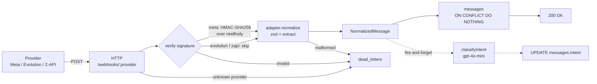

# WhatsApp Webhook Normalizer

Camada de ingestão unificada que recebe webhooks de múltiplos provedores de WhatsApp (Meta Cloud API, Evolution API, Z-API) e os normaliza em um formato interno único. TypeScript + Node + Express + Postgres.

---

## Endpoints

| Provedor | Rota | Método |
|---|---|---|
| Meta Cloud API | `POST /webhooks/meta` · `GET /webhooks/meta` (handshake) | POST / GET |
| Evolution API | `POST /webhooks/evolution` | POST |
| Z-API | `POST /webhooks/zapi` | POST |

Rota a cadastrar no painel do provedor: `POST /webhooks/<adapter.id>`. Em dev, `ngrok http 3000` gera o HTTPS público.

---

## Arquitetura



**Camadas** ([src/](src/)):

- **HTTP** — Express com `rawBody` preservado; rota parametrizada; error handler tipado → status + `dead_letters`.
- **Security** — dispatcher por provedor; HMAC-SHA256 + verify-token para Meta; hook pronto para os outros.
- **Registry** — `Map<providerId, Adapter>` em O(1).
- **Adapters** — um arquivo `*.adapter.ts` por provedor; [src/adapters/index.ts](src/adapters/index.ts) faz **auto-discovery** no boot (adicionar provedor = só criar o arquivo).
- **Persistence** — `pg` + SQL migrations; idempotência via `UNIQUE (provider_id, external_id)`.
- **LLM** — classificação de intenção pós-persistência, fire-and-forget.
- **Observability** — logger JSON estruturado com `requestId`, `providerId`, `durationMs`.

---

## Como rodar

Pré-requisitos: Node ≥ 18, um Postgres, opcionalmente uma `OPENAI_API_KEY`.

```bash
npm install
cp .env.example .env        # editar DATABASE_URL e opcionais
npm run migrate
npm run dev                 # http://localhost:3000
```

`.env` mínimo:
```
DATABASE_URL=postgresql://...
META_APP_SECRET=            # opcional — skip HMAC se vazio
META_VERIFY_TOKEN=          # opcional — só pro handshake da Meta
OPENAI_API_KEY=             # opcional — LLM desativa se vazio
```

---

## Stack

| Camada | Escolha | Motivo |
|---|---|---|
| Linguagem | TypeScript (strict) | Tipagem forte |
| Runtime | Node.js + Express 5 | `rawBody` trivial para HMAC |
| Banco | Postgres | Sem ORM; SQL visível |
| DB client | `pg` puro + SQL migrations | Schema visível |
| Validação | zod | Tipagem inferida direto do schema |
| LLM | OpenAI `gpt-4o-mini` | Baixa latência, JSON mode nativo |

---

## Pattern: Strategy + Registry

Cada provedor é uma Strategy isolada (um arquivo). O Registry faz lookup por ID em O(1). O ID já vem na URL `/webhooks/:provider`, então não precisa de `canHandle(payload)` com chain de responsabilidade.

**Por que não config-driven (JSON/DB mapping):** os três provedores têm auth específica (HMAC-SHA256 com `rawBody` na Meta), conversões de timestamp heterogêneas (string-segundos vs número-segundos vs milissegundos) e lógica condicional (`conversation ?? extendedTextMessage.text` no Evolution). Um engine genérico precisaria de gambiarras para cada caso — duas coisas pra manter sem ganhar nada.

---

## Como adicionar um novo provedor

**1 arquivo novo, zero arquivos existentes tocados.**

1. Criar `src/adapters/<nome>.adapter.ts` implementando `ProviderAdapter` — ver [src/adapters/fake.adapter.ts](src/adapters/fake.adapter.ts) como referência (~20 linhas).
2. Reiniciar o servidor.

O [loader](src/adapters/index.ts) escaneia a pasta no boot e registra qualquer `*.adapter.ts`. A rota `/webhooks/<nome>` já existe (é parametrizada); `messages.provider_id` é `TEXT` sem FK, então nenhuma migration é necessária. Rota sem adapter correspondente → 404 `UnknownProviderError` + entrada em `dead_letters`.

---

## Segurança

**Meta — HMAC-SHA256 + verify-token:**
- `GET /webhooks/meta` valida `hub.verify_token`, devolve `hub.challenge` (handshake inicial).
- `POST /webhooks/meta` — middleware [meta.ts](src/security/meta.ts) calcula HMAC sobre `rawBody` com `META_APP_SECRET` e compara com `X-Hub-Signature-256` via `timingSafeEqual`. Falha → 401 + dead_letter.
- Sem `META_APP_SECRET` no `.env`, o middleware faz skip (modo dev).

**Evolution e Z-API** usam token simples em header — hook pronto no [dispatcher](src/security/index.ts), plugável com um `case` novo.

---

## Testar

cURL (exemplo Meta sem HMAC em modo dev):
```bash
curl -X POST http://localhost:3000/webhooks/meta \
  -H "Content-Type: application/json" \
  -d '{"entry":[{"changes":[{"value":{"metadata":{"display_phone_number":"5511999999999"},"contacts":[{"profile":{"name":"João"},"wa_id":"5511988888888"}],"messages":[{"from":"5511988888888","id":"wamid.test","timestamp":"1677234567","type":"text","text":{"body":"olá"}}]}}]}]}'
# → {"ok":true,"externalMessageId":"wamid.test"}
```

Provedor desconhecido:
```bash
curl -X POST http://localhost:3000/webhooks/telegram -d '{}' -H "Content-Type: application/json"
# → 404 {"ok":false,"error":"UnknownProviderError",...}
```

Testes unitários: `npm test` (vitest).

---

## Suposições

- Apenas **mensagens de texto** são normalizadas (mídia fica como extensão futura).
- Campo `to` é opcional — Z-API não expõe destinatário no payload.
- HMAC só implementado para Meta; Evolution/Z-API com hook plugável.
- **Fire-and-forget do LLM:** se o processo cair entre `res.send` e a resposta do LLM, o `intent` fica nulo e dá pra reclassificar depois. Em troca de não precisar de fila.
